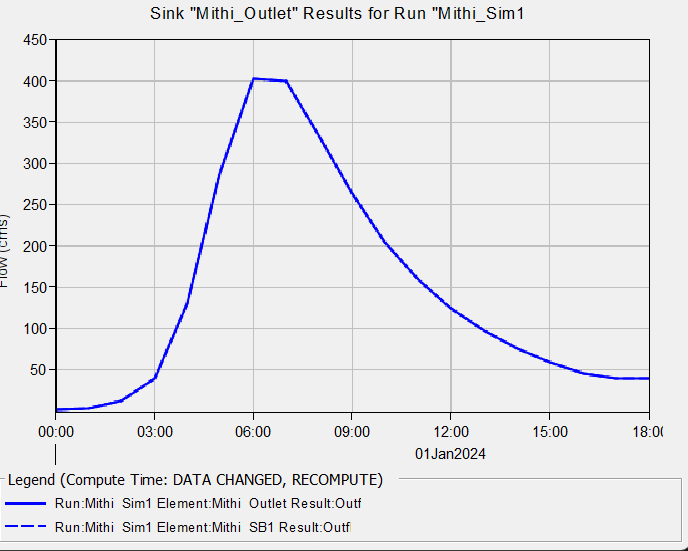

# Mithi River Watershed — Rainfall-Runoff Modeling (QGIS + HEC-HMS)

## Objective
Delineate the Mithi River watershed (Mumbai) from DEM data and simulate 
its flood response to a design storm using HEC-HMS, to estimate peak 
discharge for urban flood-risk assessment.

## Study Area
- Mithi River basin, Mumbai — approx. 72 sq km
- Drains from Powai/Vihar Lakes to Mahim Creek, Arabian Sea
- Notable for its role in the 26th July 2005 Mumbai flood event

## Data & Tools
- DEM: SRTM 30m (USGS EarthExplorer)
- Watershed delineation: QGIS (SAGA Fill Sinks, Flow Accumulation, 
  Channel Network and Drainage Basins)
- Rainfall input: Design storm derived from published IDF curves for 
  Mumbai (Zope, Eldho & Jothiprakash, 2016, IIT Bombay) — Kothyari & 
  Garde method, 25-year return period, 6-hour duration, distributed 
  using the Alternating Block Method
- Hydrologic modeling: HEC-HMS 4.13 (Clark Unit Hydrograph transform, 
  Initial & Constant loss method, Recession baseflow)

## Methodology
1. Delineated watershed boundary and stream network from DEM in QGIS
2. Built a lumped basin model in HEC-HMS (Area = 72 km²)
3. Constructed a 25-year, 6-hour design storm hyetograph from published 
   Mumbai IDF relationships
4. Simulated rainfall-runoff response at the basin outlet

## Key Results
- Peak Discharge: 402.8 m³/s
- Time to Peak: 6 hours
- Runoff Volume: 135.07 mm

## Outputs
- `outputs/mithi_hydrograph.png` — simulated outflow hydrograph
## Hydrograph Result

## Reference
Zope, P.E., Eldho, T.I. and Jothiprakash, V. (2016) Development of 
Rainfall Intensity Duration Frequency Curves for Mumbai City, India. 
Journal of Water Resource and Protection, 8, 756-765.
